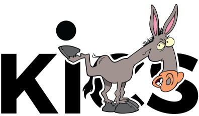

[![checkmarx](https://img.shields.io/endpoint?url=https://9d2t12mzp1.execute-api.eu-west-1.amazonaws.com/default/kics-get-cxflow-scanresults?style=plastic&logoWidth=20&logo=data:image/png;base64,iVBORw0KGgoAAAANSUhEUgAAACAAAAAgCAYAAABzenr0AAAACXBIWXMAAA7EAAAOxAGVKw4bAAADbklEQVRYhc2XTWidRRSGn3MJl1AkZFFcFCkFIYKCYMEgIhZEMtNS2kHBvxYbl1kUIqELQXHhQigtCK266EIoSt0YplbsTJGqaFFahC6yiiJFUIJ2IUGClJLj4vvu/X7uTC7cJOoLH5eZM3Ped37OOXPhP4akOl20XeAQsB+YAsZH9H8HuAVcAxa9CStDBbhgDyKcAfaMSJoVo8pZEd7wJqwNCHDRdlSZF+H0FhO3cR3FeBv+BOjUDM8InEZhm79pFT5w0Xb6Aly0Eyjvb+OqGxBVBzwJMAaA8jLCTrQ3olRbHNBv5TcKxoCH6e10z6cKKMeAr8ZKwsN94r5MABaAd7wJ6yMKwEU7A8SG/+J3Gqo78GBi7tXNkpf4giIUG1CYBOiUl2FHYuLNLSAH1SnQXQnDbYBOlkTZNHmRU+QbkG7bJsi3UF3CQbRS1OFoxwSeRplEuOpN+D1LHO048DbKfNJ3gXPQzANZuGh3CHyNchm4gPKji/axzNgp4BrKfN6jnvU23KwJSMhsds2iPF5rT6jqJy7ae2vEHRftUVR/QNm7wXoCIid6jTIMhYEc0BRzf/9ISpuI7EK54KI1qoyrckZgdsBXfTHCe8Cr3oQ7PdfVEQjNOG3mhC8z454CzolwQ4TZDeavIjwPHK+TVzswHJ+jfIhwNGGbHTL3e+CIN+HnlDF/B2rwJqwjzAFLw5RW0HXgJLAvRw79HUi8S1qavAl/uWifBb0BMjGEfQXkmDfhSr2zLHr3ACveFvknH4YJTd6EZUVe2ZBauQI8UicvI+Qt4A+EXxH9zkV7XyUgVbczuGjCIsqpxJy7wAmE/Ymn1wzK6yjdYqxMA+9C/wiq2ltbSR7Cayi7FZ4rZulPKnLkognXM7uyL9H3BPR2QGSwFEv+eLwJdxFeFOEBhEcReShLXvjrtkoxSFEIe2G4BkzWRWjxGs6iLGLLG42p+5ImOcCaN2G9J2AJaJRMgQMu2peAj0cty2WpfwE4kDAvQZWILgEzrQEd4CNgwUXzS/OM2ncm294N2bpwqS7gvMKbAjsTA/eCtJy0Y3RYuwlVbotwHspL6E1YFWXuX3iSg4LAnDdhtS+gFL2oxSN0eyEsICxWzRZctAfL0rpnK3kVbolw3JvwWVNPAi7aLsohZNN/Tv8GllEuI3zaLsX/C/wDM7pjD59N2pkAAAAASUVORK5CYII=&cacheSeconds=3600)](https://sast.checkmarx.net/cxwebclient/portal#/projectState/702/Summary)

  

---

**KICS** is an open source solution for static code analysis of Infrastructure as Code.

**K**eeping **I**nfrastructure as **C**ode **S**ecure (in short **KICS**) is a must-have for any cloud native project. With KICS, finding security vulnerabilities, compliance issues, and infrastructure misconfigurations happens early in the development cycle, when fixing these is straightforward and cheap.

It is as simple as running a CLI tool, making it easy to integrate into any project CI.

#### Supported Platforms

&nbsp;&nbsp;&nbsp;&nbsp;&nbsp;&nbsp;&nbsp;&nbsp;&nbsp;&nbsp;&nbsp;&nbsp;

Support of other solutions and additional cloud providers are on the [roadmap](docs/roadmap.md).

## Getting Started

Setting up and using KICS is super-easy.

-   First, see how to [install and get KICS running](docs/getting-started.md).
-   Then explore KICS [output results format](docs/results.md) and quickly fix the issues detected.

Interested in more advanced stuff?
-   Deep dive into KICS [queries](docs/queries.md).
-   Understand how to [integrate](docs/integrations.md) KICS in your favourit CI/CD pipelines.

## How it Works

What makes KICS really powerful and popular is its built-in extensibility. This extensibility is achieved by:

-   Fully customizable and adjustable heuristics rules, called [queries](docs/queries.md). These can be easily edited, extended and added.
-   Robust but yet simple [architecture](docs/architecture.md), which allows quick addition of support for new Infrastructure as Code solutions.

## Release process

KICS release process is quite simple. We have nightly builds that will pack and pre-release all changes merged into master.
The nightly release will have a "nightly" prefix with the last commit hash code. We have binaries available for both Windows and Linux, as well a Docker image in <a href="https://hub.docker.com/r/checkmarx/kics" target="_blank">DockerHub</a>

## Contribution

KICS is a true community project. It's built as an open source from day one, and anyone can find his own way to contribute to the project.  
[Check out how](docs/CONTRIBUTING.md), within just minutes, you can start making a difference, by sharing your expertise with a community of thousands of security experts and software developers.

## More

[KICS public documentation](https://docs.kics.io/) has all the project aspects covered.  
Join the chat <a href="https://gitter.im/kics-io/community" target="_blank">on Gitter</a>.  
Or contact KICS core team at [kics@checkmarx.com](mailto:kics@checkmarx.com)

**Keeping Infrastructure as Code Secure!**

---

&copy; 2021 Checkmarx Ltd. All Rights Reserved.
