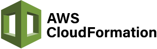
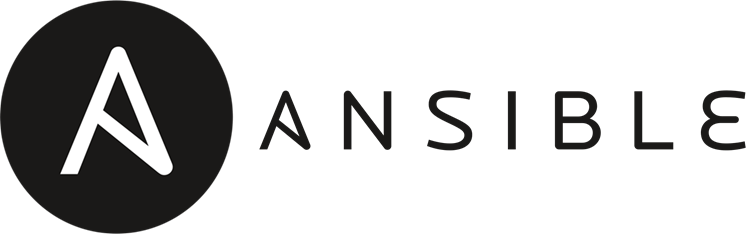
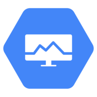
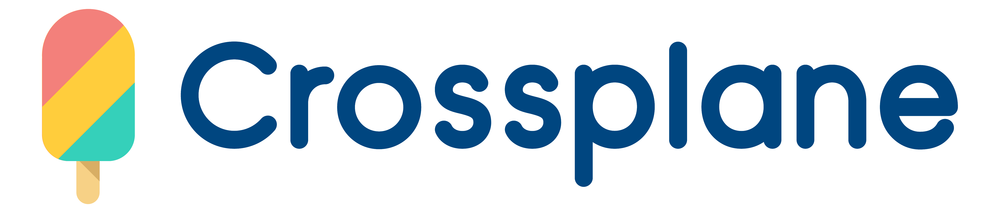

[![checkmarx](https://img.shields.io/endpoint?url=https://pgp36n22ol.execute-api.eu-west-1.amazonaws.com/dev/cxflowcache-results?style=plastic&logoWidth=20&logo=data:image/png;base64,iVBORw0KGgoAAAANSUhEUgAAACAAAAAgCAYAAABzenr0AAAACXBIWXMAAA7EAAAOxAGVKw4bAAADbklEQVRYhc2XTWidRRSGn3MJl1AkZFFcFCkFIYKCYMEgIhZEMtNS2kHBvxYbl1kUIqELQXHhQigtCK266EIoSt0YplbsTJGqaFFahC6yiiJFUIJ2IUGClJLj4vvu/X7uTC7cJOoLH5eZM3Ped37OOXPhP4akOl20XeAQsB+YAsZH9H8HuAVcAxa9CStDBbhgDyKcAfaMSJoVo8pZEd7wJqwNCHDRdlSZF+H0FhO3cR3FeBv+BOjUDM8InEZhm79pFT5w0Xb6Aly0Eyjvb+OqGxBVBzwJMAaA8jLCTrQ3olRbHNBv5TcKxoCH6e10z6cKKMeAr8ZKwsN94r5MABaAd7wJ6yMKwEU7A8SG/+J3Gqo78GBi7tXNkpf4giIUG1CYBOiUl2FHYuLNLSAH1SnQXQnDbYBOlkTZNHmRU+QbkG7bJsi3UF3CQbRS1OFoxwSeRplEuOpN+D1LHO048DbKfNJ3gXPQzANZuGh3CHyNchm4gPKji/axzNgp4BrKfN6jnvU23KwJSMhsds2iPF5rT6jqJy7ae2vEHRftUVR/QNm7wXoCIid6jTIMhYEc0BRzf/9ISpuI7EK54KI1qoyrckZgdsBXfTHCe8Cr3oQ7PdfVEQjNOG3mhC8z454CzolwQ4TZDeavIjwPHK+TVzswHJ+jfIhwNGGbHTL3e+CIN+HnlDF/B2rwJqwjzAFLw5RW0HXgJLAvRw79HUi8S1qavAl/uWifBb0BMjGEfQXkmDfhSr2zLHr3ACveFvknH4YJTd6EZUVe2ZBauQI8UicvI+Qt4A+EXxH9zkV7XyUgVbczuGjCIsqpxJy7wAmE/Ymn1wzK6yjdYqxMA+9C/wiq2ltbSR7Cayi7FZ4rZulPKnLkognXM7uyL9H3BPR2QGSwFEv+eLwJdxFeFOEBhEcReShLXvjrtkoxSFEIe2G4BkzWRWjxGs6iLGLLG42p+5ImOcCaN2G9J2AJaJRMgQMu2peAj0cty2WpfwE4kDAvQZWILgEzrQEd4CNgwUXzS/OM2ncm294N2bpwqS7gvMKbAjsTA/eCtJy0Y3RYuwlVbotwHspL6E1YFWXuX3iSg4LAnDdhtS+gFL2oxSN0eyEsICxWzRZctAfL0rpnK3kVbolw3JvwWVNPAi7aLsohZNN/Tv8GllEuI3zaLsX/C/wDM7pjD59N2pkAAAAASUVORK5CYII=)](https://sast.checkmarx.net/cxwebclient/portal#/projectState/702/Summary)

---

Find security vulnerabilities, compliance issues, and infrastructure misconfigurations early in the development cycle of your infrastructure-as-code with **KICS** by Checkmarx.

**KICS** stands for **K**eeping **I**nfrastructure as **C**ode **S**ecure, it is open source and is a must-have for any cloud native project.

#### Supported Platforms

&nbsp;&nbsp;&nbsp;
&nbsp;&nbsp;&nbsp;
&nbsp;&nbsp;&nbsp;
 
 
&nbsp;&nbsp;&nbsp;
&nbsp;&nbsp;&nbsp;
&nbsp;&nbsp;&nbsp;
 
 
&nbsp;&nbsp;&nbsp;
&nbsp;&nbsp;&nbsp;
&nbsp;&nbsp;&nbsp;
&nbsp;&nbsp;&nbsp;
 
 
&nbsp;&nbsp;&nbsp;
&nbsp;&nbsp;&nbsp;
&nbsp;&nbsp;&nbsp;
&nbsp;&nbsp;&nbsp;
 
 
&nbsp;&nbsp;&nbsp;
&nbsp;&nbsp;&nbsp;
&nbsp;&nbsp;&nbsp;
 
 
&nbsp;&nbsp;&nbsp;

Support of other solutions and additional cloud providers are on the [roadmap](docs/roadmap.md).

## Getting Started

Setting up and using KICS is super-easy.

-   First, see how to [install and get KICS running](docs/getting-started.md).
-   Then explore KICS [output results format](docs/results.md) and quickly fix the issues detected.

Interested in more advanced stuff?
-   Deep dive into KICS [queries](docs/queries.md).
-   Understand how to [integrate](docs/integrations.md) KICS in your favourite CI/CD pipelines.

See [KICS documentation](https://docs.kics.io/) for more details and topics.

## How it Works

What makes KICS really powerful and popular is its built-in extensibility. This extensibility is achieved by:

-   Fully customizable and adjustable heuristics rules, called [queries](docs/queries.md). These can be easily edited, extended and added.
-   Robust but yet simple [architecture](docs/architecture.md), which allows quick addition of support for new Infrastructure as Code solutions.

## Contribution

KICS is a true community project. It's built as an open source from day one, and anyone can find his own way to contribute to the project.
[Check out how](docs/CONTRIBUTING.md), within just minutes, you can start making a difference, by sharing your expertise with a community of thousands of security experts and software developers.

You're welcome to join our monthly [community meetings](docs/community.md), talk with us on <a href="https://github.com/Checkmarx/kics/discussions" target="_blank">GitHub discussions</a> or contact KICS core team at [kics@checkmarx.com](mailto:kics@checkmarx.com).

## Meet us at conferences

-   [Blackhat ASIA 2023](https://www.blackhat.com/asia-23/arsenal/schedule/index.html#kics---your-iac-secure-now-31009) (video TBD)
-   [AWS re:Invent 2021: AWS On Air](https://youtu.be/9ZKldJeBHl4) ([video](https://youtu.be/9ZKldJeBHl4))
-   [OWASP Bristol & Suffolk Chapter - Meetup](https://www.meetup.com/OWASP-Bristol/events/281869377/) ([video](https://youtu.be/KKZJEJF6I0M))
-   [OWASP Canberra Chapter - Meetup](https://www.meetup.com/OWASP-Canberra-Chapter/events/281946376/)
-   [InfoSec City - Singapore 2021](https://www.infosec-city.com/sin21-bizcomm)
-   [DevSecOps Singapore 2021](https://devopscon.io/cloud-platforms-serverless/infrastructure-is-the-new-code-is-your-devsecops-ready/)
-   [Blackhat Europe 2021](https://www.blackhat.com/eu-21/arsenal/schedule/#kics-keeping-infrastructure-as-code-secure-25111)
-   [HashiTalks IL 2021](https://events.hashicorp.com/hashitalksisrael) ([video](https://www.youtube.com/watch?v=DFRiSVH4lu0))
-   [Yalla DevOps 2021](https://yalla-devops.com/) ([video](https://youtu.be/Hs_YbAH9giI))
-   [Geektime Code 2021](https://code.geektime.co.il/)
-   [DevSecCon24 2021](https://www.devseccon.com/devseccon24-2021/) ([video](https://www.youtube.com/watch?v=eaD-tGMOKe8))
-   [GISEC Global 2021](https://www.gisec.ae/gisec-2021-conference/insecure-infrastructure-as-code-leaves-the-door-open-for-hackers-1wez)
-   [Blackhat ASIA 2021](https://www.blackhat.com/asia-21/arsenal/schedule/#kics-22475) ([video](https://www.youtube.com/watch?v=56AM1wiIOss))

**Keeping Infrastructure as Code Secure!**

---

&copy; 2023 Checkmarx Ltd. All Rights Reserved.
