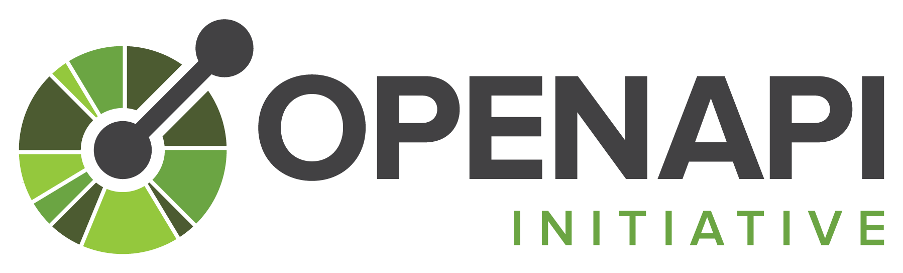
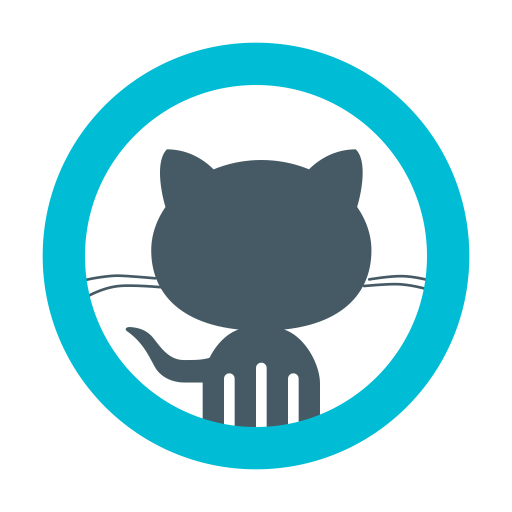

[![checkmarx](https://img.shields.io/endpoint?url=https://pgp36n22ol.execute-api.eu-west-1.amazonaws.com/dev/cxflowcache-results?style=plastic&logoWidth=20&logo=data:image/png;base64,iVBORw0KGgoAAAANSUhEUgAAACAAAAAgCAYAAABzenr0AAAACXBIWXMAAA7EAAAOxAGVKw4bAAADbklEQVRYhc2XTWidRRSGn3MJl1AkZFFcFCkFIYKCYMEgIhZEMtNS2kHBvxYbl1kUIqELQXHhQigtCK266EIoSt0YplbsTJGqaFFahC6yiiJFUIJ2IUGClJLj4vvu/X7uTC7cJOoLH5eZM3Ped37OOXPhP4akOl20XeAQsB+YAsZH9H8HuAVcAxa9CStDBbhgDyKcAfaMSJoVo8pZEd7wJqwNCHDRdlSZF+H0FhO3cR3FeBv+BOjUDM8InEZhm79pFT5w0Xb6Aly0Eyjvb+OqGxBVBzwJMAaA8jLCTrQ3olRbHNBv5TcKxoCH6e10z6cKKMeAr8ZKwsN94r5MABaAd7wJ6yMKwEU7A8SG/+J3Gqo78GBi7tXNkpf4giIUG1CYBOiUl2FHYuLNLSAH1SnQXQnDbYBOlkTZNHmRU+QbkG7bJsi3UF3CQbRS1OFoxwSeRplEuOpN+D1LHO048DbKfNJ3gXPQzANZuGh3CHyNchm4gPKji/axzNgp4BrKfN6jnvU23KwJSMhsds2iPF5rT6jqJy7ae2vEHRftUVR/QNm7wXoCIid6jTIMhYEc0BRzf/9ISpuI7EK54KI1qoyrckZgdsBXfTHCe8Cr3oQ7PdfVEQjNOG3mhC8z454CzolwQ4TZDeavIjwPHK+TVzswHJ+jfIhwNGGbHTL3e+CIN+HnlDF/B2rwJqwjzAFLw5RW0HXgJLAvRw79HUi8S1qavAl/uWifBb0BMjGEfQXkmDfhSr2zLHr3ACveFvknH4YJTd6EZUVe2ZBauQI8UicvI+Qt4A+EXxH9zkV7XyUgVbczuGjCIsqpxJy7wAmE/Ymn1wzK6yjdYqxMA+9C/wiq2ltbSR7Cayi7FZ4rZulPKnLkognXM7uyL9H3BPR2QGSwFEv+eLwJdxFeFOEBhEcReShLXvjrtkoxSFEIe2G4BkzWRWjxGs6iLGLLG42p+5ImOcCaN2G9J2AJaJRMgQMu2peAj0cty2WpfwE4kDAvQZWILgEzrQEd4CNgwUXzS/OM2ncm294N2bpwqS7gvMKbAjsTA/eCtJy0Y3RYuwlVbotwHspL6E1YFWXuX3iSg4LAnDdhtS+gFL2oxSN0eyEsICxWzRZctAfL0rpnK3kVbolw3JvwWVNPAi7aLsohZNN/Tv8GllEuI3zaLsX/C/wDM7pjD59N2pkAAAAASUVORK5CYII=)](https://sast.checkmarx.net/cxwebclient/portal#/projectState/702/Summary)

---

Find security vulnerabilities, compliance issues, and infrastructure misconfigurations early in the development cycle of your infrastructure-as-code with **KICS** by Checkmarx.

**KICS** stands for **K**eeping **I**nfrastructure as **C**ode **S**ecure, it is open source and is a must-have for any cloud native project.

### Supported Platforms

 
<table align="center"><tr>
<td>
<a href="https://github.com/Checkmarx/kics/blob/master/docs/platforms.md#terraform">
<picture>
<source media="(prefers-color-scheme: light)" srcset="docs/img/logo-terraform.png" alt="Terraform" width="120" />
<source media="(prefers-color-scheme: dark)" srcset="docs/img/logo-terraform-dark.png" alt="Terraform" width="120" />

</picture>
</a>
</td>
<td>
<a href="https://github.com/Checkmarx/kics/blob/master/docs/platforms.md#kubernetes">
<picture>
<source media="(prefers-color-scheme: light)" srcset="docs/img/logo-k8s.png" width="160">
<source media="(prefers-color-scheme: dark)" srcset="docs/img/logo-k8s-dark.png" width="160">

</picture>
</a>
</td>
<td>

</td>
</tr></table>
<table align="center"><tr>
<td>
<a href="https://github.com/Checkmarx/kics/blob/master/docs/platforms.md#cloudformation">
<picture>
<source media="(prefers-color-scheme: light)" srcset="docs/img/logo-cf.png" width="150">
<source media="(prefers-color-scheme: dark)" srcset="docs/img/logo-cf-dark.png" width="150">

</picture>
</a>
</td>
<td>
<a href="https://github.com/Checkmarx/kics/blob/master/docs/platforms.md#ansible">
<picture>
<source media="(prefers-color-scheme: light)" srcset="docs/img/logo-ansible.png" width="150">
<source media="(prefers-color-scheme: dark)" srcset="docs/img/logo-ansible-dark.png" width="150">

</picture>
</a>
</td>
<td>
<a href="https://github.com/Checkmarx/kics/blob/master/docs/platforms.md#helm">
<picture>
<source media="(prefers-color-scheme: light)" srcset="docs/img/logo-helm-alt.png" width="60">
<source media="(prefers-color-scheme: dark)" srcset="docs/img/logo-helm-dark.png" width="60">

</picture>
</a>
</td>
</tr></table>
<table align="center"><tr>
<td>
<a href="https://github.com/Checkmarx/kics/blob/master/docs/platforms.md#openapi">
<picture>
<source media="(prefers-color-scheme: light)" srcset="docs/img/logo-openapi.png" width="185">
<source media="(prefers-color-scheme: dark)" srcset="docs/img/logo-openapi-dark.png" width="185">

</picture>
</a>
</td>
<td>
<a href="https://github.com/Checkmarx/kics/blob/master/docs/platforms.md#grpc">
<picture>
<source media="(prefers-color-scheme: light)" srcset="docs/img/logo-grpc.png" width="135">
<source media="(prefers-color-scheme: dark)" srcset="docs/img/logo-grpc-dark.png" width="135">

</picture>
</a>
</td>
<td>
<a href="https://github.com/Checkmarx/kics/blob/master/docs/platforms.md#azure-resource-manager">

</td>
<td>

</td>
</tr></table>
<table align="center"><tr>
<td>
<a href="https://github.com/Checkmarx/kics/blob/master/docs/platforms.md#cdk">
<picture>
<source media="(prefers-color-scheme: light)" srcset="docs/img/logo-cdk.png" width="175">
<source media="(prefers-color-scheme: dark)" srcset="docs/img/logo-cdk-dark.png" width="175">

</picture>
</a>
</td>
<td>

</td>
<td>

</td>
<td>

</td>
</tr></table>
<table align="center"><tr>
<td>
<a href="https://github.com/Checkmarx/kics/blob/master/docs/platforms.md#crossplane">
<picture>
<source media="(prefers-color-scheme: light)" srcset="docs/img/logo-crossplane.png" width="165">
<source media="(prefers-color-scheme: dark)" srcset="docs/img/logo-crossplane-dark.png" width="165">

</picture>
</a>
</td>
<td>
<a href="https://github.com/Checkmarx/kics/blob/master/docs/platforms.md#pulumi">
<picture>
<source media="(prefers-color-scheme: light)" srcset="docs/img/logo-pulumi.png" width="145">
<source media="(prefers-color-scheme: dark)" srcset="docs/img/logo-pulumi-dark.png" width="145">

</picture>
</a>
</td>
<td>
<a href="https://github.com/Checkmarx/kics/blob/master/docs/platforms.md#serverlessfw">
<picture>
<source media="(prefers-color-scheme: light)" srcset="docs/img/logo-serverlessfw.png" width="170">
<source media="(prefers-color-scheme: dark)" srcset="docs/img/logo-serverlessfw-dark.png" width="170">

</picture>
</a>
</td>
</tr></table>
<table align="center"><tr>
<td>

</td>
<td>

</td>
<td>
<a href="https://github.com/Checkmarx/kics/blob/master/docs/platforms.md#terraform">
<picture>
<source media="(prefers-color-scheme: light)" srcset="docs/img/logo-opentofu.png" width="160">
<source media="(prefers-color-scheme: dark)" srcset="docs/img/logo-opentofu-dark.png" width="160">

</picture>
</a>
</td>
<td>

</td>
<td>

</td>
</tr></table>

### Beta Features

<picture>
<source media="(prefers-color-scheme: light)" srcset="docs/img/logo-databricks.png" width="200">
<source media="(prefers-color-scheme: dark)" srcset="docs/img/logo-databricks-dark.png" width="200">

</picture>
&nbsp;&nbsp;&nbsp;&nbsp;&nbsp;&nbsp;&nbsp;&nbsp;&nbsp;&nbsp;&nbsp;
<picture>
<source media="(prefers-color-scheme: light)" srcset="docs/img/logo-tencentcloud.png" width="180">
<source media="(prefers-color-scheme: dark)" srcset="docs/img/logo-tencentcloud-dark.png" width="180">

</picture>
&nbsp;&nbsp;&nbsp;

By default, Databricks, NIFCloud, and TencentCloud queries run when you scan Terraform files using KICS.

The `Severity` and `Description` of these queries are still under review.

## Getting Started

Setting up and using KICS is super-easy.

-   First, see how to [install and get KICS running](docs/getting-started.md).
-   Then explore KICS [output results format](docs/results.md) and quickly fix the issues detected.

Interested in more advanced stuff?
-   Deep dive into KICS [queries](docs/queries.md).
-   Understand how to [integrate](docs/integrations.md) KICS in your favourite CI/CD pipelines.

See [KICS documentation](https://docs.kics.io/) for more details and topics.

## How it Works

What makes KICS really powerful and popular is its built-in extensibility. This extensibility is achieved by:

-   Fully customizable and adjustable heuristics rules, called [queries](docs/queries.md). These can be easily edited, extended and added.
-   Robust but yet simple [architecture](docs/architecture.md), which allows quick addition of support for new Infrastructure as Code solutions.

## Community

You're welcome to join our [community](docs/community.md), talk with us on <a href="https://github.com/Checkmarx/kics/discussions" target="_blank">GitHub discussions</a> or contact KICS core team at [kics@checkmarx.com](mailto:kics@checkmarx.com).

### KICS Contributors

See our individual contributors in the [community](docs/community.md) page. You're welcome to join them by [contributing](docs/CONTRIBUTING.md) to KICS.

We also like to thank the following organizations for their ongoing contribution:
-   [Checkmarx](https://checkmarx.com/)
-   [Bedrock Streaming](https://bedrockstreaming.com/) (since v1.4.8)
-   [Dynatrace](https://www.dynatrace.com/) (since v1.5.1)
-   [Orca Security](https://orca.security/) (since v1.5.10)

### KICS Users
KICS is used by various companies and organizations, some are listed below. If you would like to be included here please open a PR.

-   [Checkmarx](https://checkmarx.com/) ([IaC Security](https://checkmarx.com/product/iac-security/))
-   [GitLab](https://gitlab.com/) ([Infrastructure as Code scanning](https://docs.gitlab.com/ee/user/application_security/iac_scanning/))
-   [Bedrock Streaming](https://bedrockstreaming.com/)
-   [Cisco](https://www.panoptica.app/) ([CI/CD Securitry](https://docs.panoptica.app/docs/ci-cd-security))
-   [Orca Security](https://orca.security/)
-   [JIT](https://www.jit.io/) ([SAST for IaC](https://www.jit.io/security-tools/kics))
-   [Firefly](https://www.firefly.ai/) ([Firefly Integrates With Checkmarx's KICS](https://www.firefly.ai/blog/firefly-integrates-with-checkmarxs-kics-to-enable-seamless-cloud-governance-from-code-to-cloud))
-   [Redpanda](https://redpanda.com/)
-   [Keptn](https://github.com/keptn) / [Keptn Lifecycle Toolkit](https://keptn.sh)
 
**Keeping Infrastructure as Code Secure!**

---

&copy; 2025 Checkmarx Ltd. All Rights Reserved.