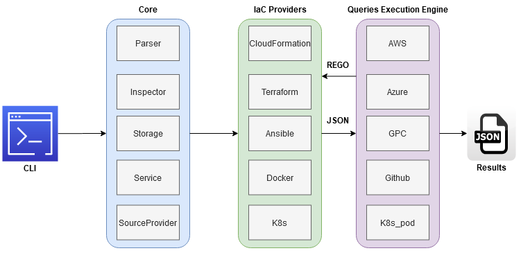
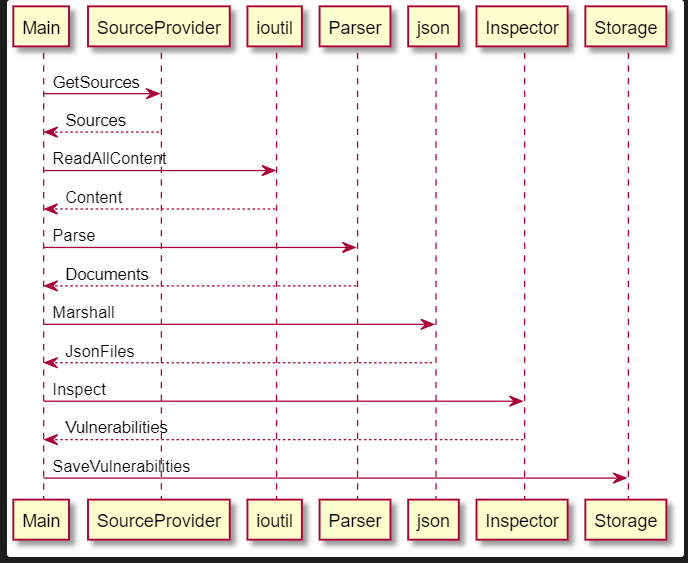

## Overview

KICS is 100% open source is written in Golang using Open Policy Agent ([OPA](https://www.openpolicyagent.org/)).

Golang speed, simplicity and reliability made it the perfect choice for writing KICS, while [Rego](https://www.openpolicyagent.org/docs/latest/policy-language/) as a query language, was a native choice to implement security queries. 

So far have written 900+ ready-to-use queries that cover a wide range of vulnerabilities checks for AWS, GCP, Azure and other cloud providers. 

## High Level Architecture

KICS has a pluggable architecture with extensible pipeline of parsing IaC languages, which allows an easy integration of new IaC languages and queries.

At a high very level, KICS is composed of the following main components: a command line interface, parser, queries execution engine,  IaC providers,  security queries, and results writer.

- Command Line Interface => Provides CLI input to KICS.
- Parser => responsible for parsing input IaC files (terraform and others)
- IaC Providers => Converts IaC language into normalized JSON
- Queries Execution Engine => applies REGO queries against normalized JSON
- Security Queries => pre-built REGO queries for each security and misconfiguration
- Writer => Writes results into JSON format

  

## Execution Flow

The sequence diagram below depicts interaction of the main KICS components:  
  
