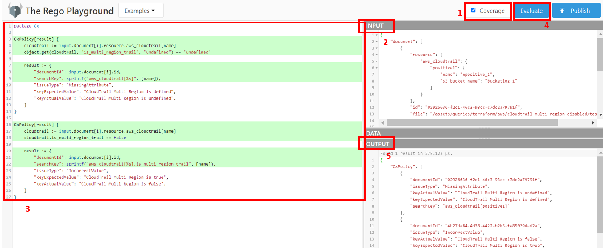

## Create a new Query

The queries are written in Rego and our internal parser transforms every IaC file that supports into a universal JSON format. This way anyone can start working on a query by picking up a small sample of the vulnerability that the query should target, and convert this sample, which can be a .tf or .yaml file, to our JSON structure JSON. To convert the sample you can run the following command:

```bash
docker run -t -v ./:/path checkmarx/kics scan -p "pathToTestData" -d "pathToGenerateJson"
```

So for example, if we wanted to transform a .tf file in ./src/test we could type:

```bash
docker run -t -v ./:/path checkmarx/kics scan -p  "/path/src/test" -d "/path/src/test/input.json"
```

Example of input.json

```json
{
	"document": [
		{
			"resource": {
				"aws_cloudtrail": {
					"positive1": {
						"name": "npositive_1",
						"s3_bucket_name": "bucketlog_1"
					}
				}
			},
			"id": "02926636-f2c1-46c3-93cc-c7dc2a79791f",
			"file": "/assets/queries/terraform/aws/cloudtrail_multi_region_disabled/test/positive1.tf"
		},
		{
			"resource": {
				"aws_cloudtrail": {
					"positive2": {
						"name": "npositive_2",
						"s3_bucket_name": "bucketlog_2",
						"is_multi_region_trail": false
					}
				}
			},
			"id": "4b27da84-4d38-4422-b2b5-fa85029dad2a",
			"file": "assets/queries/terraform/aws/cloudtrail_multi_region_disabled/test/positive2.tf"
		}
	]
}
```

After having the .json that will be our Rego input, we can begin to write queries.
To test and debug there are two ways:

- [Using Rego playground](https://play.openpolicyagent.org/)
- [Install Open Policy Agent extension](https://marketplace.visualstudio.com/items?itemName=tsandall.opa) in VS Code and create a simple folder with a .rego file for the query and a input.json for the sample to test against

#### Query Development Tutorial

In the first instance, take a look at the query composition:
- **query.rego**: Includes the policy and defines the result. The policy builds the pattern that breaks the security of the infrastructure code, which the query is looking for. The result defines the specific data used to present the vulnerability in the infrastructure code.
- **metadata.json**: Each query has a metadata.json companion file with all the relevant information about the vulnerability, including the severity, category and its description;
- **test**: Folder that contains at least one negative and positive case and a JSON file with data about the expected results.

```
- <technology>
    |- <provider>
    |   |- <queryfolder>
    |   |   |- test
    |   |   |   |- positive1<.ext>
    |   |   |   |- positive2<.ext>
    |   |   |   |- negative1<.ext>
    |   |   |   |- negative2<.ext>
    |   |   |   |- positive_expected_result.json
    |   |   |- metadata.json
    |   |   |- query.rego
```

Now, focus on the content of each file:

👨‍💻 **REGO File**

As a first step, it is important to be familiar with the libraries available (check them in `assets/libraries`) and the JSON structure (Rego input). Also, we need to study all the possible cases related to the vulnerability we want to verify before starting the implementation.

For example, if we want to verify if the AWS CloudTrail has MultiRegion disabled in a Terraform sample, we need to focus on the attribute `is_multi_region_trail` of the resource `aws_cloudtrail`. Since this attribute is optional and false by default, we have two cases: (1) `is_multi_region_trail` is undefined and (2) `is_multi_region_trail` is set to false. Observe the following implementation as an example and check the Guidelines below.

🚨 **Make sure you use ```package Cx```. If you give another name, the query will not load.** 🚨

```
package Cx

CxPolicy[result] {
	cloudtrail := input.document[i].resource.aws_cloudtrail[name]
	object.get(cloudtrail, "is_multi_region_trail", "undefined") == "undefined"

	result := {
		"documentId": input.document[i].id,
		"searchKey": sprintf("aws_cloudtrail[%s]", [name]),
		"issueType": "MissingAttribute",
		"keyExpectedValue": "CloudTrail Multi Region should be defined",
		"keyActualValue": "CloudTrail Multi Region is undefined",
	}
}

CxPolicy[result] {
	cloudtrail := input.document[i].resource.aws_cloudtrail[name]
	cloudtrail.is_multi_region_trail == false

	result := {
		"documentId": input.document[i].id,
		"searchKey": sprintf("aws_cloudtrail[%s].is_multi_region_trail", [name]),
		"issueType": "IncorrectValue",
		"keyExpectedValue": "CloudTrail Multi Region should be set to true",
		"keyActualValue": "CloudTrail Multi Region is set to false",
	}
}
```

To test the query in the [Rego playground](https://play.openpolicyagent.org/), perform the following steps:
1. Enable Coverage (highlights which statements were evaluated);
2. In the input, paste the payload (explained above);
3. In the playground, paste and/or write the policies. Check if the statements are painted green;
4. Click on Evaluate;
5. In the output, check if the results are as expected.




👨‍💻 **Metadata File**

Observe the following metadata.json example and check the Guidelines below for more detailed information.

```json
{
  "id": "8173d5eb-96b5-4aa6-a71b-ecfa153c123d",
  "queryName": "CloudTrail Multi Region Disabled",
  "severity": "MEDIUM",
  "category": "Observability",
  "descriptionText": "CloudTrail should have 'is_multi_region_trail' and 'include_global_service_events' enabled",
  "descriptionUrl": "https://registry.terraform.io/providers/hashicorp/aws/latest/docs/resources/cloudtrail#is_multi_region_trail",
  "platform": "Terraform",
  "descriptionID": "feb82a62",
  "cloudProvider": "aws"
}
```

👨‍💻 **Data File**

This file contains a map, with string keys, which will have default values for keys that can be overwritten as described on [allowing users to overwrite query data section](#allowing-users-to-overwrite-query-data) and [using custom input data section of Running KICS](./running-kics.md#using-custom-input-data)

👨‍💻 **Test Folder**

Keep in mind that all the positive and negative files should contain only one breaking point case. This way, the results are more clear. As a best practice, the test folder should contain all the [extensions available](https://docs.kics.io/latest/platforms/) by the platform.


Each positive case should present a breaking point of the vulnerability. Continuing with the example, we should display two positive files: one without the `is_multi_region_trail` defined (positive1.tf) and another with the `is_multi_region_trail` set to false (positive2.tf).

*positive1.tf*

```
resource "aws_cloudtrail" "positive1" {
  name                          = "npositive_1"
  s3_bucket_name                = "bucketlog_1"
}
```

*positive2.tf*

```
resource "aws_cloudtrail" "positive2" {
  name                          = "npositive_2"
  s3_bucket_name                = "bucketlog_2"
  is_multi_region_trail         = false
}
```

Each negative case should present the remediation/best practice (a sample with the `is_multi_region_trail` set to true).

*negative1.tf*

```
resource "aws_cloudtrail" "negative1" {
  name                          = "negative"
  s3_bucket_name                = "bucketlog"
  is_multi_region_trail         = true
}
```

The positive expected result should present where the positive(s) file(s) break(s) the vulnerability (in line 2 (positive1.tf) and line 4 (positive2.tf)).

```json
[
  {
    "queryName": "CloudTrail Multi Region Disabled",
    "severity": "MEDIUM",
    "line": 2,
    "fileName": "positive1.tf"
  },
  {
    "queryName": "CloudTrail Multi Region Disabled",
    "severity": "MEDIUM",
    "line": 4,
    "fileName": "positive2.tf"
  }
]
```


#### Testing

For a query to be considered complete, it must be compliant with at least one positive and one negative test case. To run the unit tests you can run this command:

```bash
make test
```

Check if the new test was added correctly and if all tests are passing locally. If succeeds, a Pull Request can now be created.

#### Guidelines

Filling metadata.json:

- `id` should be filled with a UUID. You can use the built-in command to generate this:

```bash
go run ./cmd/console/main.go generate-id
```

- `queryName` describes the name of the vulnerability
- `severity` can be filled with `CRITICAL`, `HIGH`, `MEDIUM`, `LOW` or `INFO`
- `category` pick one of the following:
    - Access Control
    - Availability
    - Backup
    - Best Practices
    - Build Process
    - Encryption
    - Insecure Configurations
    - Insecure Defaults
    - Networking and Firewall
    - Observability
    - Resource Management
    - Secret Management
    - Supply-Chain
- `descriptionText` should explain with detail the vulnerability and if possible provide a way to remediate
- `descriptionUrl` points to the official documentation about the resource being targeted
- `platform` query target platform (e.g. Terraform, Kubernetes, etc.)
- `descriptionID` should be filled with the first eight characters of the `go run ./cmd/console/main.go generate-id` output
- `cloudProvider` should specify the target cloud provider, when necessary (e.g. AWS, AZURE, GCP, etc.)
- `aggregation` [optional] should be used when more than one query is implemented in the same query.rego file. Indicates how many queries are implemented
- `override` [optional] should only be used when a `metadata.json` is shared between queries from different platforms or different specification versions like for example OpenAPI 2.0 (Swagger) and OpenAPI 3.0. This field defines an object that each field is mapped to a given `overrideKey` that should be provided from the query execution result (covered in the next section), if an `overrideKey` is provided, this will generate a new query that inherits the root level metadata values and only rewrites the fields defined inside this object.


If the **query.rego** file implements more than one query, the **metadata.json** should indicate how many are implemented (through `aggregation`). That can be necessary due to two cases:
1. It implements more than one query in the same **query.rego** for the same platform

```json
{
  "id": "0ac9abbc-6d7a-41cf-af23-2e57ddb3dbfc",
  "queryName": "Sensitive Port Is Exposed To Entire Network",
  "severity": "HIGH",
  "category": "Networking and Firewall",
  "descriptionText": "A sensitive port, such as port 23 or port 110, is open for the whole network in either TCP or UDP protocol",
  "descriptionUrl": "https://docs.ansible.com/ansible/latest/collections/azure/azcollection/azure_rm_securitygroup_module.html#parameter-rules",
  "platform": "Ansible",
  "descriptionID": "33745204",
  "cloudProvider": "azure",
  "aggregation": 62
}
```

2. It implements the same query for different platforms in the same **query.rego**, the metadata below defines the query metadata for both OpenAPI 2.0 and 3.0 in the same file:

```json
{
  "id": "332cf2ad-380d-4b90-b436-46f8e635cf38",
  "queryName": "Invalid Contact URL (v3)",
  "severity": "INFO",
  "category": "Best Practices",
  "descriptionText": "Contact Object URL should be a valid URL",
  "descriptionUrl": "https://swagger.io/specification/#contact-object",
  "platform": "OpenAPI",
  "override": {
    "2.0": {
      "id": "c7000383-16d0-4509-8cd3-585e5ea2e2f2",
      "queryName": "Invalid Contact URL (v2)",
      "descriptionUrl": "https://swagger.io/specification/v2/#contactObject"
    }
  },
  "aggregation": 2,
  "descriptionID": "f3097573"
}
```

Filling query.rego:

- `documentId` id of the sample where the vulnerability occurs
- `searchKey` uses Levenshtein distance to go through the original document. It should “include” as much information as possible so that the result is as accurate as possible. 

    Note the following special chars:
    - '='    -> value
    - '.'    -> break line
    - '{{ }}' -> ignore special chars
    - '[ ]'   -> same line

    As an example, take a look at the following sample:

    

    If we want to point to the field 'Name' set as 'My.bucket' of 'tags', the searchKey should be set to `resource[positive].tags.Name={{My.bucket}}`

- `issueType` pick one of the following:
    - IncorrectValue
    - MissingAttribute
    - RedundantAttribute
- `keyExpectedValue` should explain the expected value
- `keyActualValue`   should explain the actual value detected
- `overrideKey` [optional] should be used when the query can be applied to more than one platform (for now, it is used for both OpenAPI 3.0 and Swagger)

For example, the query `Invalid Contact URL` can be implemented in both OpenAPI 3.0 and Swagger since both versions share the same properties:

```
package Cx

import data.generic.openapi as openapi_lib

CxPolicy[result] {
	doc := input.document[i]
	version := openapi_lib.check_openapi(doc)
	version != "undefined"

	not openapi_lib.is_valid_url(doc.info.contact.url)

	result := {
		"documentId": doc.id,
		"searchKey": "info.contact.url",
		"issueType": "IncorrectValue",
		"keyExpectedValue": "info.contact.url has a valid URL",
		"keyActualValue": "info.contact.url has an invalid URL",
		"overrideKey": version,
	}
}
```

- `searchValue` [optional] should be used when the query returns more than one result for the same line
- `searchLine` [optional] path where the breaking point occurs in the sample

For example, the query **Sensitive Port Is Exposed To Entire Network** can return more than one result in the same line (the ingress covers a range of ports). To avoid it, the *searchValue* should be used.

```
package Cx

import data.generic.terraform as terraLib
import data.generic.common as commonLib

CxPolicy[result] {
	resource := input.document[i].resource.aws_security_group[name]

	portContent := commonLib.tcpPortsMap[port]
	portNumber = port
	portName = portContent
	protocol := terraLib.getProtocolList(resource.ingress.protocol)[_]

	endswith(resource.ingress.cidr_blocks[_], "/0")
	terraLib.containsPort(resource.ingress, portNumber)
	isTCPorUDP(protocol)

	result := {
		"documentId": input.document[i].id,
		"searchKey": sprintf("aws_security_group[%s].ingress", [name]),
		"searchValue": sprintf("%s,%d", [protocol, portNumber]),
		"issueType": "IncorrectValue",
		"keyExpectedValue": sprintf("%s (%s:%d) should not be allowed", [portName, protocol, portNumber]),
		"keyActualValue": sprintf("%s (%s:%d) is allowed", [portName, protocol, portNumber]),
	}
}

isTCPorUDP("TCP") = true
isTCPorUDP("UDP") = true
```
#### Search Line

To improve the KICS line detection mechanism, `searchLine` was introduced.

SearchLine uses json path to get the correct line information from the payload (which can be seen with the flag `payload-lines`).

For Ansible Hosts and Config files, there is no need to fill this parameter since the attributes can vary in different files. If you still want to use you will expect an inconsistent behaviour.

Original Content:
```
father:
  name: son
```

Payload With Line Information:
```
{
    "_kics_lines": {
        "_kics__default": {
            "_kics_line": 0
        },
        "_kics_father": {
            "_kics_line": 2
        }
    },
    "father": {
        "_kics_lines": {
            "_kics__default": {
                "_kics_line": 2
            },
            "_kics_name": {
                "_kics_line": 3
            }
        },
        "name": "son"
    }
},
```

Usage:

```
import data.generic.common as commonLib

result := {
		"documentId": doc.id,
		"searchKey": "father.son",
		"issueType": "IncorrectValue",
		"searchLine": commonLib.build_search_line(["father", "son"], []),
	}
```

Function `build_search_line(path, obj)`:

The function `build_search_line` is a helper that builds the searchLine for the engine to create and use the json path.
It take two arguments:

- path: An array containing the path elements (keys and indexes) to the desired key line.. (ex: ["father", "son"]; ["father", 1, "son"]; ["father", "son", 0])

- obj: For queries that use the function `walk` in rego, where the caller is given a path that should be placed in the `path` argument of `build_search_line`, the remaining path not present should be placed in obj. Obj can also be used in other queries that don't make use of the function `walk`, otherwise it should be passed empty. (ex: ["son"],["son", 0])

Examples:

```
    build_search_line(["father"], ["son"])
```
```
    build_search_line(["father", "son"], [])
```
```
    build_search_line(["father", "son"], ["grandson", 1])
```
```
    [path, value] := walk(x)
    son := value.son
    son == false
    build_search_line(path, ["son"])
```

##### Ansible Inventory
To create a `searchLine` query in Rego for this case, you need to think of the path as if you were dealing with a YAML/JSON file. This way, the query will be capable of locating vulnerabilities in all three types of Ansible host files.

#### Allowing users to overwrite query data
Starting on v1.3.5, KICS started to support custom data overwriting on queries. This can be useful if users want to provide their own dataset or if users have different datasets for multiple environments. This can be supported easily following some steps:

1. Create a `data.json` file on the same level as `query.rego`;
2. Define **ALL** keys that can be overwritten with their default value;
3. On `query.rego` file, use `data.<key_on_data_json_file>` to access the value of this key;

With these simple steps, users will be able to overwrite the keys they want, elsewhere will use the default value.

#### Query Dependencies
If you want to use the functions defined in your own library, you should use the flag `-b` to indicate the directory where the libraries are placed. The functions need to be grouped by platform and the library name should follow the following format: `<platform>.rego`. It doesn't matter your directory structure. In other words, for example, if you want to indicate a directory that contains a library for your terraform queries, you should group your functions (used in your terraform queries) in a file named `terraform.rego` wherever you want.
