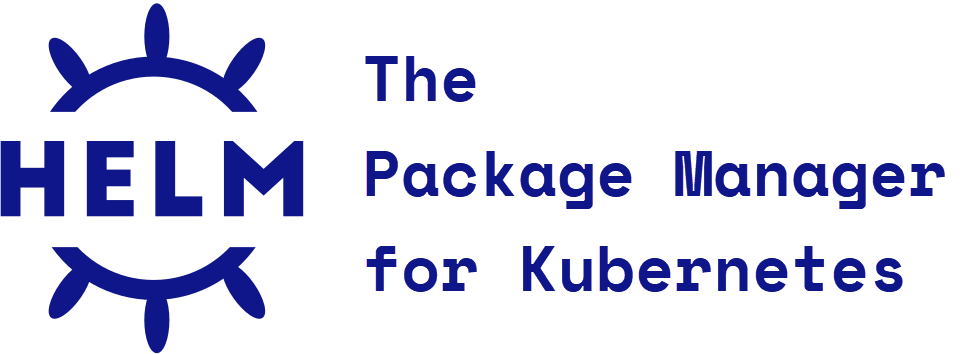

    

        
        
         
          
        
Find security vulnerabilities, compliance issues, and infrastructure misconfigurations early in the development cycle of your infrastructure-as-code with <b>KICS</b> by Checkmarx.

        
<b>KICS</b> stands for <b>K</b>eeping <b>I</b>nfrastructure as <b>C</b>ode <b>S</b>ecure, it is open source and is a must-have for any cloud native project.

    

    

          
        <h4>Version 1.6.14</h4>
        
2023.04.11

        <a class="btn btn-outline-success"  href="https://docs.kics.io/latest/CONTRIBUTING">Contribute!</a>
    

---

#### Supported Platforms

KICS scans and detects issues in following Infrastructure as Code solutions:

        &nbsp;&nbsp;&nbsp;

        &nbsp;&nbsp;&nbsp;

        &nbsp;&nbsp;&nbsp;

        &nbsp;&nbsp;&nbsp;

        &nbsp;&nbsp;&nbsp;

        &nbsp;&nbsp;&nbsp;

        &nbsp;&nbsp;&nbsp;

        &nbsp;&nbsp;&nbsp;

        &nbsp;&nbsp;&nbsp;

        &nbsp;&nbsp;&nbsp;

        &nbsp;&nbsp;&nbsp;

        &nbsp;&nbsp;&nbsp;

        &nbsp;&nbsp;&nbsp;

        &nbsp;&nbsp;&nbsp;

        &nbsp;&nbsp;&nbsp;

        &nbsp;&nbsp;&nbsp;

        &nbsp;&nbsp;&nbsp;

        &nbsp;&nbsp;&nbsp;

Support of other solutions, such as Chef, and of additional cloud providers are on the [roadmap](roadmap.md).

## Getting Started

Setting up and using KICS is super-easy.

-   First, see how to [install and get KICS running](getting-started.md).
-   Then explore KICS [output results format](results.md) and quickly fix the issues detected.

Interested in more advanced stuff?

-   Deep dive into KICS [queries](queries.md).
-   Understand how you to [integrate](integrations.md) KICS in your favorite CI/CD pipelines.

## How it Works

What makes KICS really powerful and popular is its built-in extensibility. This extensibility is achieved by:

-   Fully customizable and adjustable heuristics rules, called [queries](queries.md). These can be easily edited, extended and added.
-   Robust but yet simple [architecture](architecture.md), which allows quick addition of support for new Infrastructure as Code solutions.

## Contribution

KICS is a true community project. It's built as an open source project from day one and anyone can find his own way to contribute to the project.
[Check out how](CONTRIBUTING.md), within just minutes, you can start making a difference, by sharing your expertise with a community of thousands of security experts and software developers.

-   [How can I help?!](CONTRIBUTING.md)
-   <a href="https://github.com/Checkmarx/kics/" target="_blank">Take me to the repo on GitHub!</a>

## About the Project

The KICS project is powered by <a href="https://www.checkmarx.com/" target="_blank">Checkmarx</a>, global leader of Application Security Testing.
[Read more](about.md) about **Infrastructure as Code**, **Infrastructure as Code Testing** and Checkmarx.

KICS will always stay an open source and free project for the benefit of global software industry community.
We believe that when **Software is Everywhere, Security is Everything**.

Now, Software **=** **Security**.

Looking for more info? Explore KICS project in details:

-   [Roadmap](roadmap.md)
-   <a href="https://github.com/Checkmarx/kics/projects" target="_blank">Project plans</a>
-   <a href="https://github.com/Checkmarx/kics/issues" target="_blank">Issues</a>

Join the <a href="https://github.com/Checkmarx/kics/discussions" target="_blank">GitHub discussions</a>.
Or contact KICS core team at [kics@checkmarx.com](mailto:kics@checkmarx.com)
