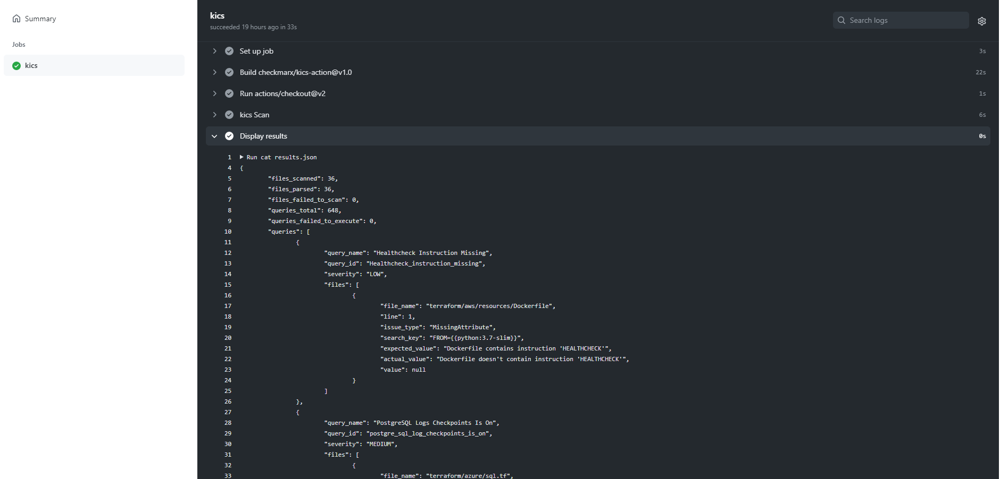

## Integrations

You can integrate KICS into your CI with Github Actions. 
This provides you an ability to integrate KICS scans and apply KICS vulnerabilities and miconfiguration checks to your infrastructure-as-a-code (IaC)

Use KICS GitHub action from the marketplace:
go to https://github.com/marketplace/actions/kics-github-action

and read about GitHub actions integration in the official GitHub documentation:

https://docs.github.com/en/free-pro-team@latest/actions/quickstart

Here you can see it in action ;)

  

Visit the KICS GitHub Action project to get more details:

https://github.com/marketplace/actions/kics-github-action

and take a look at the example usage shown above:

https://github.com/marketplace/actions/kics-github-action#example-usage
