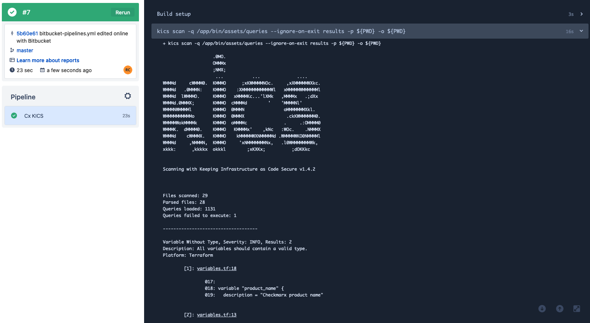

## Integrate KICS with Bitbucket Pipelines

You can integrate KICS into Bitbucket Pipelines CI/CD.

This provides you the ability to run KICS scans in your Bitbucket repositories and streamline vulnerabilities and misconfiguration checks to your infrastructure as code (IaC).

### Example configuration

```yaml
image: checkmarx/kics:latest-alpine

pipelines:
  default:
    - step:
        name: "Cx KICS"
        script:
          - kics scan -q /app/bin/assets/queries --ignore-on-exit results -p ${PWD} -o ${PWD}
        artifacts:
          - results.json
```


